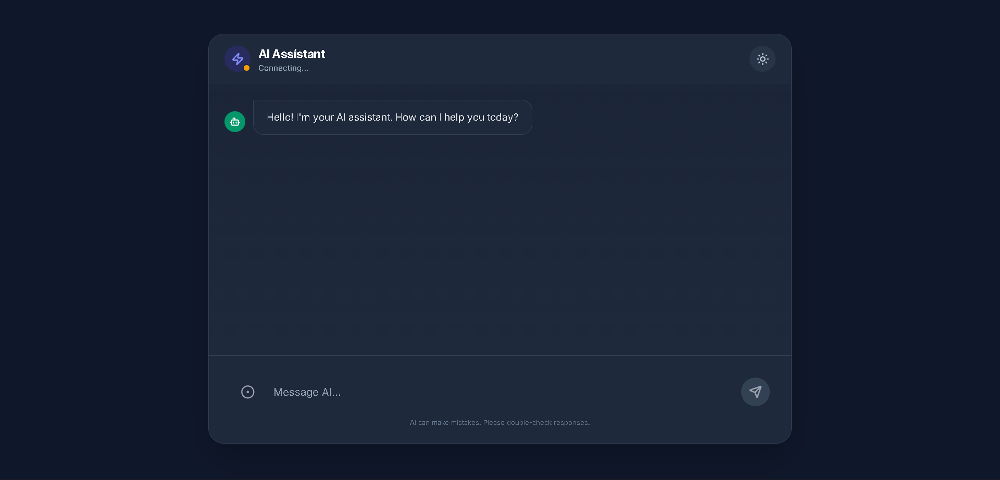

# 🤖 AI Chatobot

A full-stack real-time **AI Chatbot** built using **React**, **Node.js**, **Express**, and **Socket.IO**, with an AI model (Gemini / OpenAI compatible) generating responses.

This project demonstrates real-time messaging, a modern UI, and clean backend architecture.

---

## 🚀 Features

- ⚡ Real-time communication using Socket.IO  
- 🤖 AI-generated responses (Gemini/OpenAI)  
- 🎨 Clean styled React frontend  
- 🌐 Vite-powered development  
- 🔄 Persistent chat history  
- 🔒 Secure environment variable handling  
- 🔐 Organized backend service architecture  

---

## 📂 Project Structure
```

AiChatobot/
├─ backend/
│  ├─ src/
│  │  ├─ service/
│  │  │  └─ ai.service.js       # AI completion logic
│  │  └─ app.js                 # Express application
│  ├─ .env                      # API key, config variables
│  ├─ server.js                 # HTTP + Socket.IO server
│  ├─ package.json
│  └─ package-lock.json
│
└─ frontend/
   ├─ src/
   │  ├─ App.jsx                # Chat UI + socket client
   │  └─ main.jsx               # Entry point for React
   ├─ index.html
   ├─ package.json
   ├─ package-lock.json
   ├─ vite.config.js
   └─ README.md (optional)

```


---

## 🛠 Backend Setup

### 1️⃣ Install dependencies
```bash
cd backend
npm install
```
### 2️⃣ Add your .env
```bash
API_KEY=your_gemini_or_openai_key
```
### 3️⃣ Start backend server
```bash
npm start
```
## 🛠 Frontend Setup

### 1️⃣ Install dependencies
```bash
cd frontend
npm install
```

### 2️⃣ Start frontend (vite)
```bash
npm run dev
```
## 🔌Socket.IO Events

### Client → Server
```bash
"ai-message": {
  "prompt": "User message"
}
```

### Server → Client
```bash
"ai-response": "AI generated text"
```
---
### 📸 UI Preview


---
### 🤝 Contributing

##### Feel free to fork this project, improve the UI, add streaming, or integrate more AI providers.
---
### 📄 License

##### This project is for learning & personal use.
---
### 💡 Author

##### Built by Devansh ⚡


