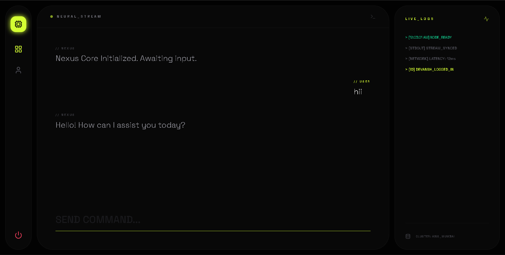
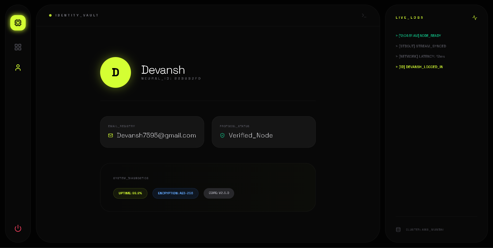

# 🤖 NEXUS AI | Neural Command Center

A high-performance, full-stack **Real-Time AI Chatbot** ecosystem. Built using the **MERN** stack, this project integrates **Socket.io** for bi-directional communication and **Generative AI** for intelligent, context-aware responses.

---

## 📸 Interface Preview

| 🖥️ Neural Dashboard | 👤 User Identity Vault |
| :---: | :---: |
|  |  |
| *Real-time AI Chat Interface* | *Secure User Profile & Registry* |

---

## 🚀 Key Features

- ⚡ **Zero Latency:** Real-time bi-directional streaming via **Socket.IO**.
- 🧠 **Neural Intelligence:** Integrated with **Google Gemini / OpenAI** models.
- 🔒 **Identity Vault:** Secure User Profile management and registry system.
- 🎨 **Luxury UI:** Cyber-Industrial design built with **React** & **Framer Motion**.
- 🛡️ **Security:** **JWT**-protected routes and **Bcrypt** password hashing.
- 📊 **Live Diagnostics:** Terminal-style log panel for system heartbeats.

---

## 🛠️ Tech Stack

| Layer | Technology |
| :--- | :--- |
| **Frontend** | React.js, Vite, Tailwind CSS, Framer Motion |
| **Backend** | Node.js, Express.js |
| **Real-time** | Socket.io |
| **Database** | MongoDB (Mongoose ODM) |
| **AI Engine** | Google Generative AI (Gemini) |
| **Icons** | Lucide React |

---

## 📂 Project Structure

```text
AiChatobot/
├─ backend/
│  ├─ src/
│  │  ├─ controllers/
│  │  │  └─ auth.controller.js   # Logic for Login/Register
│  │  ├─ db/
│  │  │  └─ db.js                # MongoDB Connection
│  │  ├─ models/
│  │  │  └─ auth.model.js        # User Schema
│  │  ├─ routes/
│  │  │  └─ auth.routes.js       # Auth Endpoints
│  │  ├─ service/
│  │  │  └─ ai.service.js        # AI Model Integration
│  │  └─ app.js                  # Express Config
│  ├─ .env                       # API Keys & Secrets
│  └─ server.js                  # Socket.io + HTTP Server
├─ frontend/
│  ├─ src/
│  │  ├─ components/
│  │  │  └─ Auth.jsx             # Auth UI Components
│  │  ├─ App.jsx                 # Main Nexus Dashboard
│  │  └─ main.jsx                # React Entry Point
│  └─ vite.config.js             # Vite Configuration
├─ dashboard.png                 # Dashboard Screenshot
└─ profile.png                   # Profile Screenshot
```
## 🔌 Socket.IO Events
Transmission (Client → Server)
```
JavaScript

// Sending prompt to AI
socket.emit("ai-message", { prompt: "System status?" });
Reception (Server → Client)
JavaScript

// Receiving AI generated response
socket.on("ai-response", (data) => { console.log(data); });
```
##  📥 Installation & Setup
1.  Backend Setup
```
cd backend
npm install
# Configure your .env with:
# MONGO_URI, JWT_SECRET, API_KEY
npm start
```
2. Frontend Setup
```
cd frontend
npm install
npm run dev
```
##  🤝 Contributing
Feel free to fork this project, improve the UI, or integrate more AI providers.
```
Built with ⚡ by Devansh
```